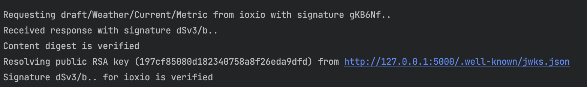

# IOXIO Dataspace Message Signatures example

This demo application is designed to show a practical example on how to create an
application and a productizer that connect to a Dataspace built with the IOXIO Dataspace
technology and implement
[HTTP Message Signatures](https://httpwg.org/http-extensions/draft-ietf-httpbis-message-signatures.html)
for data verification.

This repository contains 3 applications:

- Python [FastAPI](https://fastapi.tiangolo.com) backend that is responsible for
  authentication and requesting data from data sources
- [React](https://react.dev/)-based frontend application.
- Python [Flask](https://flask.palletsprojects.com) productizer that acts as a data
  source and returns fake weather data

Main idea is to demonstrate how to:

- Retrieve data products from Product Gateway
- Implement a productizer
- Sign and verify each request from an app to a productizer and from a productizer to an
  application

## Repo structure

- [backend](./backend/) - Python [FastAPI](https://fastapi.tiangolo.com/) backend
  - [main.py](./backend/app/main.py) - All the backend routes, e.g. for authentication
    or data retrieval
  - [settings.py](./backend/app/settings.py) - Backend configuration
  - [http_sig.py](./backend/app/http_sig.py) - Helpers for HTTP Message Signatures
- [frontend](./frontend) - React application
  - [containers](./frontend/src/containers) - Root containers for handling data products
  - [components](./frontend/src/components) - Stateless components to simplify following
    the containers' logic
  - [utils](./frontend/src/utils) - Some helpers, e.g. for making network requests to
    the backend
- [productizer](./productizer) - Productizer implementation
  - [main.py](./productizer/app/main.py) - Weather route
  - [http_sig.py](./productizer/app/http_sig.py) - Helpers for HTTP Message Signatures

## Local installation

### Configuration

Before running the app locally, you have to:

1. Register your application in the
   [Developer Portal](https://developer.sandbox.ioxio-dataspace.com/). Use the following
   values in the form:

   - Redirect URI: `http://localhost:3000/api/auth`
   - Logout redirect URI: `http://localhost:3000`

   Note: In the next step you will need the Client ID and Client secret that get
   generated when you complete the registration of the application.

2. Create the [backend/.env](backend/.env) file based on
   [backend/.env.example](backend/.env.example) and set the variables with the values
   from the previous step.

### RSA keys

Before running backend and productizer you need to
[generate RSA keys](https://cryptotools.net/rsagen) and add them as `PRIVATE_KEY` to
`.env` in backend and productizer folders. Those keys are used for HTTP Message
Signatures.

### Pre-requisites

- [Python 3.9+](https://www.python.org/) - For running the backend
- [Poetry](https://python-poetry.org/) - Python dependency management tool
- [Node](https://nodejs.org/en/) - For running the frontend
- [pnpm](https://pnpm.io/) - Node package manager
- [pre-commit](https://pre-commit.com/) - Runs hooks before you commit to e.g. format
  your code. Make sure you run `pre-commit install` after checking out the repo.

### Backend

```bash
cd backend
poetry install

poetry run dev
```

NOTE! It's important that backend is running with 2 workers because during ongoing
request productizer will try to access backend's JWKs.

### Productizer

```bash
cd backend
poetry install

poetry run flask --app app.main run --debug
```

### Frontend

```bash
cd frontend
pnpm install

pnpm dev
```

## Message Signatures

By default services are running at the following ports:

- Frontend at http://localhost:3000
- Backend at http://localhost:8080
- Productizer at http://localhost:5000

Here's an example of the output when all the services are set up properly:




